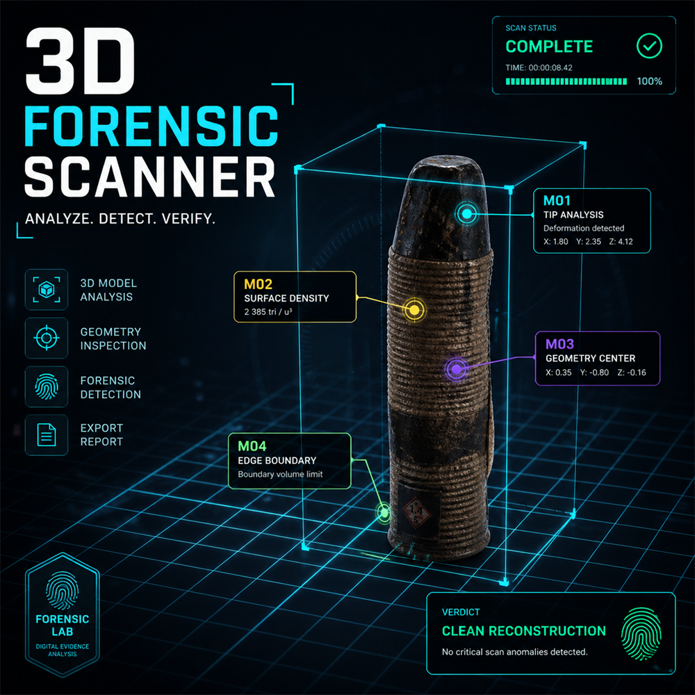

# 3D Forensic Scanner



## Project description

**3D Forensic Scanner** is an interactive web application for visual analysis of 3D Gaussian Splatting models.

The project was created as part of the MSAP multimedia assignment. The main goal is to present 3D content in an interactive and visually attractive way using a forensic-style scanner interface.

The application allows the user to load Gaussian Splatting models, inspect them directly in the browser, switch between visual analysis modes, run a simulated forensic scan, display model statistics, generate a scan verdict, open an information modal and export a PNG screenshot.

---

## Main idea

The project is focused on **3D content** and interactive Gaussian Splatting visualization.

Instead of displaying a simple static 3D object, the application presents the model as a scanned forensic target. The interface is designed as a digital analysis laboratory where reconstructed 3D scenes are inspected visually and statistically.

The application uses Gaussian Splatting models exported mainly in `.ply` format. This makes the result closer to real 3D reconstruction workflows than a standard polygonal mesh viewer.

---

## Main functionality

The application supports:

- loading predefined Gaussian Splatting models;
- uploading custom `.ply`, `.splat` or `.ksplat` models;
- interactive camera controls;
- fullscreen mode;
- PNG screenshot export;
- automatic rotation toggle;
- scene grid toggle;
- model rotation controls;
- forensic scan simulation;
- live forensic log;
- automatic scan verdict;
- Gaussian Splat model statistics;
- splat count display;
- quality estimation;
- project information modal;
- visual scan modes:
  - Natural;
  - X-Ray;
  - Density.

---

## Visual modes

| Mode | Description |
|---|---|
| Natural | Default realistic Gaussian Splatting view |
| X-Ray | Forensic-style cyan X-Ray visualization using visual filters and scan overlay |
| Density | Stronger filtering mode focused on dense and stable splat areas |

The X-Ray mode is a visual forensic effect. Since Gaussian Splatting models are not polygonal meshes, the application does not display a real internal mesh structure. Instead, it applies a stylized X-Ray-like visual mode suitable for splat-based reconstruction.

---

## Forensic scan output

After running the scan, the application displays:

| Output | Description |
|---|---|
| Complexity | Estimated model complexity based on splat count |
| Type | Model type, for example Gaussian field |
| Scene | Number of loaded splat scenes |
| Splats | Number of detected Gaussian splats |
| Quality | Estimated reconstruction quality |
| Verdict | Simple forensic conclusion generated from the scan |
| Live log | Step-by-step simulated forensic analysis log |

---

## Viewer controls

| Control | Function |
|---|---|
| Left mouse | Rotate camera |
| Mouse wheel | Zoom |
| Right mouse | Pan camera |
| Fullscreen | Opens the viewer in fullscreen mode |
| Screenshot PNG | Exports the current viewer image |
| INFO | Opens a modal window with project information, controls and supported formats |
| Run scan | Starts forensic analysis simulation |
| Natural | Shows the default splat visualization |
| X-Ray | Enables forensic X-Ray visual effect |
| Density | Enables density-focused splat filtering |
| Reset view | Resets the camera position |
| Auto rotate | Enables or disables automatic scene rotation |
| Grid | Shows or hides the background grid |
| Left / Reset / Right | Rotates the loaded model |

---

## Information modal

The project includes an **INFO** button in the left control panel.

The modal window explains:

- what the application does;
- how to control the viewer;
- which visual modes are available;
- which model formats are supported;
- which rendering technology is used.

This makes the application easier to understand directly inside the interface without reading external documentation first.

---

## Supported model formats

The application supports the following model formats:

```text
.ply
.splat
.ksplat
```

The main format used in the project is:

```text
Splat PLY
```

This format is suitable for Gaussian Splatting models exported from tools such as Polycam, Luma AI or SuperSplat.

---

## Technologies used

- HTML5
- CSS3
- JavaScript ES6+
- Three.js
- GaussianSplats3D
- SuperSplat
- Polycam / Luma AI / Kiri style Gaussian Splatting workflow
- Local web server for running ES modules and 3D assets

---

## How to run the project

The project must be started through a local server.

Opening `index.html` directly by double-clicking is not recommended, because JavaScript modules and local 3D assets may not load correctly in the browser.

---

### Option 1: Run with VS Code Live Server

1. Open the project folder in Visual Studio Code.
2. Install the **Live Server** extension if it is not installed.
3. Right-click on `index.html`.
4. Select **Open with Live Server**.
5. The project will open in the browser.

Example local address:

```text
http://127.0.0.1:5500/
```

---

### Option 2: Run with Python local server

Open a terminal in the project folder and run:

```bash
python -m http.server 5500
```

Then open this address in the browser:

```text
http://127.0.0.1:5500/
```

---

## How to use the application

1. Open the application in the browser through a local server.
2. Select one of the predefined models:
   - Room / Interior;
   - Head / Character;
   - Object.
3. Or upload your own `.ply`, `.splat` or `.ksplat` model.
4. Use mouse controls to inspect the model:
   - left mouse button to rotate the camera;
   - mouse wheel to zoom;
   - right mouse button to pan.
5. Select a visual mode:
   - Natural;
   - X-Ray;
   - Density.
6. Click **Run scan**.
7. After the scan, the application displays:
   - live forensic log;
   - scan verdict;
   - complexity level;
   - splat count;
   - quality estimation.
8. Use **INFO** to open the project information window.
9. Use **Screenshot PNG** to export the current viewer image.

---

## Project structure

```text
Vitalii_3D_Viewer/
│
├── index.html              # Main HTML structure
├── style.css               # Visual design and responsive layout
├── script.js               # Gaussian Splatting viewer logic and scanner functionality
├── README.md               # Project documentation
├── LICENSE                 # Project license
├── thumbnail.png           # Required project thumbnail, 1000 × 1000 px
├── .gitignore              # Git ignore rules
│
├── assets/
│   ├── favicon.ico         # Browser favicon
│   ├── favicon-32.png      # PNG favicon
│   └── apple-touch-icon.png
│
├── models/
│   └── splats/
│       ├── room.ply        # Room / interior Gaussian Splatting model
│       ├── person.ply      # Person / character Gaussian Splatting model
│       └── object.ply      # Object Gaussian Splatting model
│
└── vendor/
    └── optional local libraries or fallback assets
```

---

## 3D models

The project uses three predefined Gaussian Splatting models:

| Model | Description |
|---|---|
| Room / Interior | Splat reconstruction of an indoor scene |
| Head / Character | Splat reconstruction of a person or character |
| Object | Splat reconstruction of a physical object |

The models were prepared using a Gaussian Splatting workflow and cleaned or adjusted for browser presentation.

---

## Notes about Gaussian Splatting

Gaussian Splatting models are different from classic mesh models.

A traditional mesh model usually contains:

- vertices;
- edges;
- triangles;
- materials;
- textures.

A Gaussian Splatting model is instead based on many small semi-transparent points called splats. These splats together create the appearance of a reconstructed 3D scene.

Because of this, some classic mesh operations such as real wireframe rendering or triangle-based X-Ray rendering are not directly applicable. The application therefore uses splat-specific statistics and visual effects.

---

## Important notes

The application is fully client-side and does not require a backend server.

All model loading, visualization, scan simulation, information modal and screenshot export are handled directly in the browser.

For correct functionality, the project should be served through a local server because ES modules and local 3D assets may be blocked when opening the HTML file directly.

Large archive files such as `.zip`, `.rar` or video exports should not be committed to the repository, because GitHub has file size limits.

---

## License

This project is licensed under the Creative Commons Attribution 4.0 International License (CC BY 4.0).

See the `LICENSE` file for details.

---

## Author

Vitalii Maksym

MSAP project  
3D content – interactive Gaussian Splatting forensic scanner
